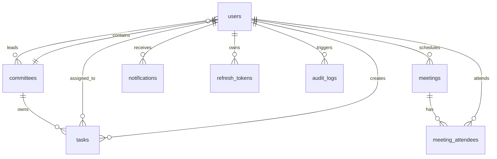

# EPIC OFFICE — وثيقة الهيكلة والمعمارية التقنية (Architecture & System Design)

## 1. ملخص النظام (System Overview)

**EPIC OFFICE** هو منصة سحابية متكاملة مصممة لإدارة وتشغيل نادي **EPIC Club**. يوفر النظام بيئة مركزية لتنظيم العمليات الداخلية للنادي، ويشمل إدارة الأعضاء، اللجان، المهام التنفيذية، الاجتماعات الدورية، وتتبع الأداء ومؤشرات الإنجاز عبر لوحات تحكم تحليلية تفاعلية.

النظام مبني وفق معمارية الخدمات المنفصلة (**Decoupled Architecture**) حيث تعمل واجهة المستخدم الأمامية (Frontend) باستقلالية تامة عن مخدّم الواجهة الخلفية (Backend API) عبر بروتوكولات RESTful آمنة ومشفرة.

---

## 2. المكدس التقني (Technology Stack)

| الطبقة | التقنية / المكتبة | الغرض والاستخدام |
|---|---|---|
| **الواجهة الأمامية** | Next.js 14 (App Router) + TypeScript | بناء واجهة مستخدم سريعة، متجاوبة، ومبنية على SSR & CSR |
| **التصميم والتنسيق** | Tailwind CSS + Lucide React + Framer Motion | تصميم حديث وهوية بصرية موحدة وأيقونات تفاعلية وحركات سلسة |
| **إدارة الحالة وجلب البيانات** | Zustand + TanStack React Query v5 | إدارة حالة الجلسة والتنبيهات، والتخزين المؤقت للبيانات من الـ API |
| **الواجهة الخلفية** | Node.js + Express.js (REST API) | خادم واجهات برمجة التطبيقات وإدارة منطق الأعمال |
| **قاعدة البيانات الأساسية** | PostgreSQL (مع مكتبة `pg` Pool) | التخزين العلائقي لكافة الكيانات، الجلسات، وسجلات التدقيق |
| **الكاش وتحديد المعدل** | Redis (عبر `ioredis` و `rate-limit-redis`) | تخزين مؤقت للعمليات السريعة وتطبيق Rate Limiting على الـ API |
| **الأمان والحماية** | Helmet + CORS + Zod + Express-Validator | حماية الرؤوس وتصفية الهجمات (XSS / CSRF) والتحقق الصارم من المدخلات |
| **المصادقة والتشفير** | JWT + Google OAuth Library + Bcrypt.js | جلسات موثوقة، تسجيل عبر حساب Google، وتشفير كلمات المرور |
| **التنبيهات والبريد** | Nodemailer (SMTP Service) | إرسال رسائل التحقق من البريد والإشعارات التلقائية |
| **الحاويات والنشر** | Docker Compose + Render + Fly.io + Vercel | إعدادات تشغيل الحاويات محلياً وسحابياً بسهولة |

---

## 3. الهيكلة الشاملة للمجلدات (Project Directory Structure)

```text
EPIC OFFICE/
├── docker-compose.yml              # تشغيل بيئة العمل المتكاملة (Postgres + Redis + Backend + Frontend)
├── render.yaml / fly.toml          # ملفات النشر والتوزيع السحابي للبنية التحتية
├── EPIC-OFFICE-UIUX.md             # دليل معايير التصميم وتجربة المستخدم
├── EPIC-OFFICE-ARCHITECTURE.md     # الوثيقة المعمارية للنظام (هذا الملف)
│
├── epicclub-backend/               # خادم الواجهة الخلفية (Express REST API)
│   ├── migrations/                 # سكربتات ترحيل وهيكلة قاعدة البيانات (init.sql)
│   ├── src/
│   │   ├── app.js                  # مجمع التطبيق، إعدادات الأمان، والميدلوير العام
│   │   ├── config/                 # إعدادات الاتصال بقاعدة البيانات، Redis، والتحقق من الـ ENV
│   │   ├── middleware/             # الحماية (Auth, RateLimiter, Sanitizer, RBAC)
│   │   ├── services/               # الخدمات المشتركة (Mail Service, Token Service)
│   │   ├── utils/                  # دوال المعالجة العامة والأخطاء المخصصة
│   │   └── modules/                # هيكلة مبنية على الوحدات المستقلة (Modular Architecture):
│   │       ├── auth/               # تسجيل، دخول، Google Login، استرجاع كلمة المرور
│   │       ├── users/              # ملفات الأعضاء، التفعيل، والصلاحيات
│   │       ├── committees/         # اللجان، الهيكل التنظيمي، وتعيين القادة
│   │       ├── tasks/              # مهام اللجان وتوزيعها وجدولتها
│   │       ├── meetings/           # الاجتماعات، الروابط، وتأكيد الحضور (RSVP)
│   │       ├── notifications/      # إشعارات النظام المباشرة
│   │       └── dashboard/          # إحصائيات الأداء ومؤشرات الإنجاز
│   └── package.json
│
└── epicclub-frontend/              # تطبيق الويب الأمامي (Next.js 14 App Router)
    ├── src/
    │   ├── app/
    │   │   ├── (auth)/             # مسارات التوثيق (تسجيل الدخول، إنشاء حساب، استعادة الحساب)
    │   │   ├── (dashboard)/        # المسارات المحمية للوحة التحكم (Dashboard, Tasks, Meetings...)
    │   │   ├── layout.tsx          # المخطط العام للتطبيق وتطبيق الخطوط والاتجاه RTL
    │   │   └── providers.tsx       # موفرو السياق (React Query, Toast, Auth Providers)
    │   ├── components/             # عناصر واجهة المستخدم المقسمة وظيفياً:
    │   │   ├── dashboard/          # بطاقات الإحصائيات، مخططات الأداء، والنشاطات
    │   │   ├── tasks/              # جداول المهام ولوحات السحب والإفلات (Kanban Board)
    │   │   ├── committees/         # بطاقات وإحصائيات اللجان وأعضائها
    │   │   ├── meetings/           # بطاقات الاجتماعات ونوافذ الجدولة
    │   │   └── layout/             # الشريط الجانبي (Sidebar) والشريط العلوي (Navbar)
    │   ├── store/                  # مخازن الحالة العامة (authStore, notificationStore)
    │   ├── hooks/                  # خطافات مخصصة (Custom React Hooks)
    │   ├── types/                  # تعريفات TypeScript للنماذج والبيانات
    │   └── lib/                    # إعدادات Axios Instance وإدارة الجلسات التلقائية
    └── package.json
```

---

## 4. نموذج البيانات وقاعدة البيانات (Database Schema & Relations)

تم تصميم قاعدة بيانات **PostgreSQL** بنظام علاقات متين يدعم القيود الصارمة، المعرّفات الفريدة (`UUID v4`)، والحذف المنطقي (`Soft Delete`):



### الجداول الأساسية:

| الجدول | الحقول الجوهرية | الوصف والعلاقات |
|---|---|---|
| **`users`** | `id`, `name`, `email`, `role`, `status`, `committee_id`, `password_hash`, `google_id` | جدول المستخدمين مع دعم الربط باللجنة وتحديد الحالة والدور |
| **`committees`** | `id`, `name`, `description`, `leader_id`, `created_at` | لجان النادي، وترتبط بالقائد (`leader_id -> users.id`) |
| **`tasks`** | `id`, `title`, `description`, `committee_id`, `assigned_to`, `priority`, `status`, `due_date` | مهام اللجان مع تحديد الأولوية والحالة وتاريخ الاستحقاق |
| **`meetings`** | `id`, `title`, `description`, `created_by`, `scheduled_at`, `location`, `meeting_link` | جدول الاجتماعات والروابط الافتراضية ومواقع الانعقاد |
| **`meeting_attendees`**| `meeting_id`, `user_id`, `rsvp_status` | جدول وسيط لتأكيد أو الاعتذار عن الحضور (`accepted`, `declined`, ...) |
| **`notifications`** | `id`, `user_id`, `type`, `title`, `body`, `is_read`, `metadata` | تنبيهات النظام الخاصة بكل مستخدم |
| **`refresh_tokens`** | `id`, `user_id`, `token_hash`, `expires_at`, `revoked` | مفاتيح الجلسات طويلة الأمد مع دعم الإبطال الفوري |
| **`audit_logs`** | `id`, `action`, `performed_by`, `target_user_id`, `ip_address`, `details` | سجل الرقابة والتدقيق لكافة الإجراءات الحساسة في النظام |

---

## 5. مصفوفة الصلاحيات والأدوار (RBAC Matrix)

| الوظيفة / الإجراء | رئيس النادي (President) | قائد اللجنة (Committee Leader) | العضو (Member) |
|---|:---:|:---:|:---:|
| اعتماد ورفض انضمام الأعضاء الجدد | ✅ | ❌ | ❌ |
| إنشاء وتعديل وحذف اللجان | ✅ | ❌ | ❌ |
| تعيين وإعفاء قادة اللجان | ✅ | ❌ | ❌ |
| الاطلاع على لوحة إحصائيات النادي العامة | ✅ | ✅ (محدودة) | ✅ (محدودة) |
| إنشاء وتعديل مهام اللجنة التابعة له | ✅ | ✅ | ❌ |
| تغيير حالة المهام المسندة له | ✅ | ✅ | ✅ |
| جدولة الاجتماعات ودعوة الأعضاء | ✅ | ✅ (للجنته) | ❌ |
| تأكيد / اعتذار حضور الاجتماعات (RSVP) | ✅ | ✅ | ✅ |
| مراجعة سجل التدقيق الأمني (Audit Logs) | ✅ | ❌ | ❌ |

---

## 6. مسارات ومخطط الواجهات البرمجية (API Routes Specification)

### أ. المصادقة والحسابات (`/api/auth`)
* `POST /api/auth/register` : إنشاء حساب مستخدم جديد (حالة افتراضية: `pending`).
* `POST /api/auth/login` : تسجيل الدخول بكلمة المرور والحصول على Access + Refresh Tokens.
* `POST /api/auth/google` : مصادقة حساب Google بواسطة OAuth ID Token.
* `POST /api/auth/refresh` : تجديد مفتاح الجلسة عند انتهائه تلقائياً.
* `POST /api/auth/logout` : تسجيل الخروج وإبطال الـ Token المخزن.

### ب. الأعضاء والمستخدمين (`/api/users`)
* `GET /api/users` : قائمة الأعضاء مع الفلترة حسب اللجنة والحالة والدور.
* `PATCH /api/users/:id/status` : اعتماد أو رفض طلب عضو جديد (خاص بالرئيس).
* `PATCH /api/users/:id/role` : ترقية أو تغيير دور المستخدم.
* `PATCH /api/users/:id/committee` : ضم المستخدم للجنة محددة.

### ج. اللجان والفرق (`/api/committees`)
* `GET /api/committees` : عرض جميع اللجان وإحصائيات أداء كل لجنة.
* `POST /api/committees` : إنشاء لجنة جديدة وتحديد قائدها.
* `PUT /api/committees/:id` : تعديل بيانات اللجنة أو قائدها.
* `GET /api/committees/:id/members` : عرض أعضاء لجنة محددة ومهامهم النشطة.

### د. المهام وإدارة العمل (`/api/tasks`)
* `GET /api/tasks` : جلب المهام مع إمكانية الفلترة حسب اللجنة، المكلف، والحالة.
* `POST /api/tasks` : إضافة مهمة جديدة وتحديد أولويتها وتاريخ تسليمها.
* `PATCH /api/tasks/:id/status` : نقل المهمة بين أعمدة الإنجاز (`pending` -> `in_progress` -> `completed`).
* `DELETE /api/tasks/:id` : حذف منطقي للمهمة.

### هـ. الاجتماعات والفعاليات (`/api/meetings`)
* `GET /api/meetings` : جلب الاجتماعات القادمة والسابقة.
* `POST /api/meetings` : جدولة اجتماع جديد وإرسال الدعوات للحضور.
* `POST /api/meetings/:id/rsvp` : تسجيل حالة حضور المستخدم (`accepted`, `declined`).

### و. لوحة القيادة والتنبيهات (`/api/dashboard` & `/api/notifications`)
* `GET /api/dashboard/stats` : مؤشرات الإنجاز، نسب الحضور، وتوزيع أداء اللجان.
* `GET /api/notifications` : جلب التنبيهات غير المقروءة للمستخدم.
* `PATCH /api/notifications/:id/read` : تعليم الإشعار كمقروء.

---

## 7. معايير الأمان وحماية النظام (Security Architecture)

1. **التحقق وتصفية المدخلات (Data Validation & Sanitization):**
   * فحص جميع الطلبات القادمة عبر مخططات Zod الصارمة.
   * ميدلوير تعقيم عام يمنع هجمات حقن النصوص وحقن الأوامر (Cross-Site Scripting - XSS).
2. **الحد من استهلاك الموارد (Rate Limiting):**
   * محدد معدل استدعاء عالمي مبني على Redis يمنع هجمات الحرمان من الخدمة (DDoS / Brute Force).
   * إعداد خاص للمصادقة وتكرار طلبات تسجيل الدخول.
3. **أمان الـ HTTP والجلسات:**
   * ضبط رؤوس الحماية الصارمة عبر `Helmet`.
   * سياسة CORS محددة للنطاقات المعتمدة (Frontend Origin) فقط.
   * اعتماد تشفير كلمات المرور باستخدام Salt Rounds قوي عبر `bcryptjs`.
4. **سجل الرقابة (Audit Logging):**
   * تسجيل كافة الإجراءات الإدارية (تغيير أدوار، قبول طلبات، تعديل لجان) في جدول `audit_logs` مرفقة بـ IP المستخدم ونوع الإجراء والتاريخ الزمني.

---

## 8. تدفق البيانات وسير العمليات (Workflow Cycles)

### دورة حياة المستخدم الجديد:
```text
[تسجيل حساب جديد] 
      │
      ▼
[حالة العضو: Pending] ──► [إشعار يصل لرئيس النادي]
                              │
            ┌─────────────────┴─────────────────┐
            ▼                                   ▼
      [قبول الطلب]                         [رفض الطلب]
            │
            ▼
[حالة العضو: Approved] ──► [تنسيب إلى لجنة] ──► [البدء باستلام المهام والاجتماعات]
```

### دورة حياة المهمة:
```text
[إنشاء مهمة بواسطة قائد اللجنة/الرئيس]
            │
            ▼
      [قيد الانتظار - Pending]
            │
            ▼
    [قيد التنفيذ - In Progress]
            │
            ▼
     [مكتملة - Completed] ──► [تحديث مؤشر إنجاز اللجنة في الـ Dashboard]
```

---

## 9. خطة النشر والتشغيل (Deployment Strategy)

- **البيئة المحلية (Development):**
  * تشغيل متزامن لـ PostgreSQL و Redis و Backend و Frontend عبر أمر واحد: `docker compose up -d`.
- **الإنتاج السحابي (Production):**
  * **Frontend:** استضافة مستمرة عبر Vercel مع تكامل تلقائي لـ CI/CD عند الرفع لفرع `main`.
  * **Backend API:** نشر على منصات سحابية تدعم خوادم Node.js الحية مثل Render أو Fly.io مع استغلال الـ Health Check Endpoint (`/health`).
  * **قواعد البيانات:** استخدام خدمات Managed PostgreSQL و Upstash / Redis Cloud لضمان التوافر العالي والنسخ الاحتياطي المستمر.
